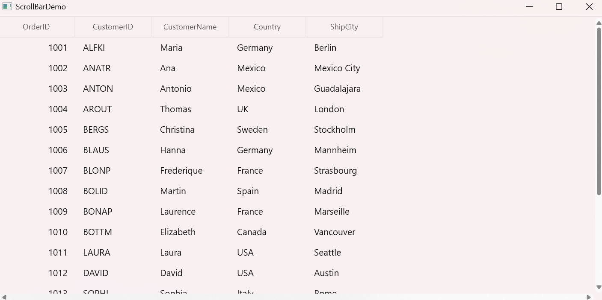

# How to keep scrollbar always visible and prevent them from collapsing in WinUI DataGrid (SfDataGrid)?

In [WinUI DataGrid](https://www.syncfusion.com/winui-controls/datagrid) (SfDataGrid), By default, the scrollbar remains collapsed when the content is insufficient to require scrolling. This behavior can be changed by installing the **AK.Toolkit.WinUI3.ScrollBarExtensions** package. After installation, the **KeepVerticalExpanded** and **KeepHorizontalExpanded** properties can be set to True in DataGrid to keep the scrollbars always visible. This ensures that the scrollbar remains in an expanded state, while the thumb becomes active only when there is sufficient content to scroll.

 ```xml
<Window x:Class="DataGridDemo.MainWindow"
          xmlns="http://schemas.microsoft.com/winfx/2006/xaml/presentation"
          xmlns:x="http://schemas.microsoft.com/winfx/2006/xaml"
          xmlns:toolKit ="using:AK.Toolkit.WinUI3"
          xmlns:dataGrid="using:Syncfusion.UI.Xaml.DataGrid">

<dataGrid:SfDataGrid x:Name="sfDataGrid"
                     toolKit:ScrollBarExtensions.KeepVerticalExpanded="True"
                     toolKit:ScrollBarExtensions.KeepHorizontalExpanded="True"
                     ItemsSource="{Binding Orders}">
</dataGrid:SfDataGrid> 
 ```



Take a moment to peruse the [WinUI DataGrid - Scrolling](https://help.syncfusion.com/winui/datagrid/selection#scrolling-rows-or-columns) documentation, to learn more about scrolling with examples.